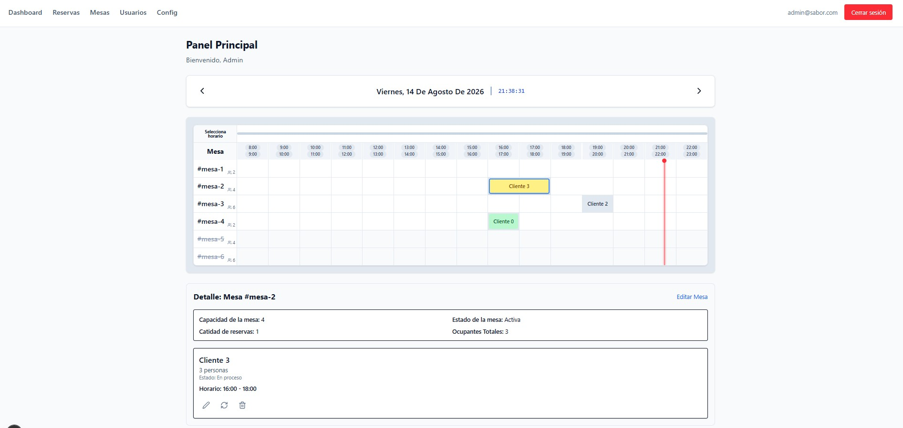
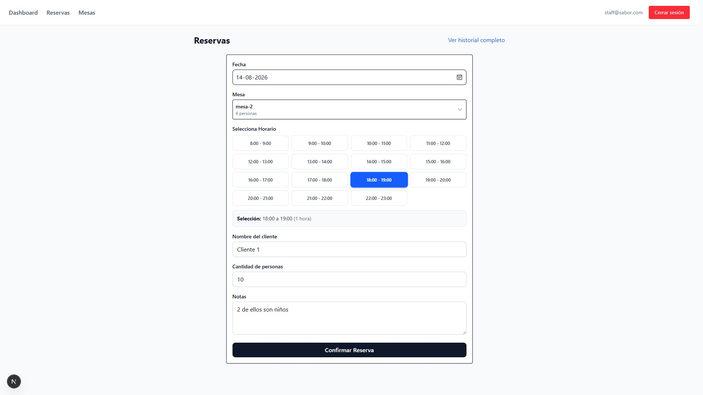
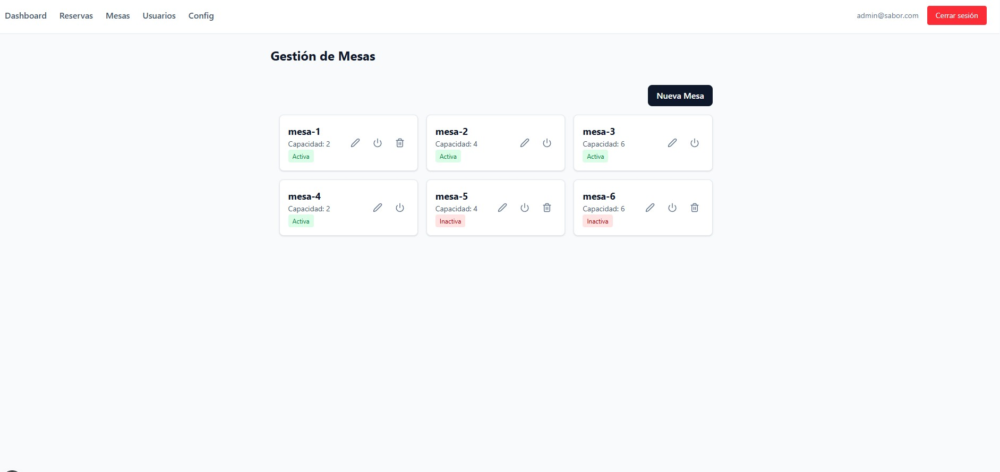
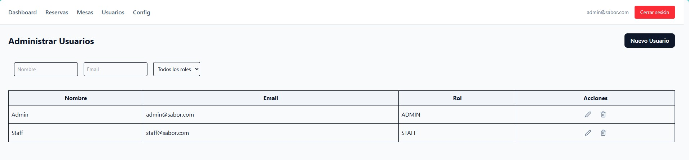
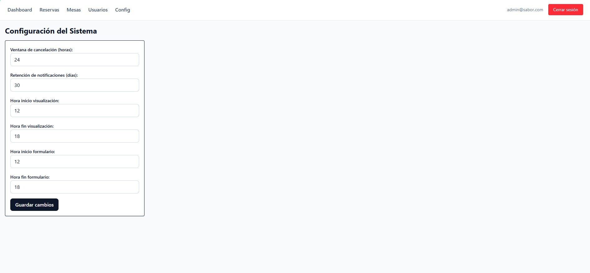

# 🍽️ Sabor Gourmet

Sistema de gestión de reservas en tiempo real para "Sabor Gourmet".

## 🎯 Objetivo
Plataforma eficiente para la gestión de mesas con control de acceso granular por roles (`Staff`, `Admin`).

El sitio fue desarrollado para que los administradores del restaurante **Sabor Gourmet** cuenten con un sistema moderno para controlar y gestionar sus reservas.

## 🧭 Secciones de la aplicación

### Inicio / Dashboard
Panel principal para visualizar el estado general de las reservas. Incluye un indicador con la hora actual, que permite identificar el bloque horario activo.

Al seleccionar una reserva, se muestra su detalle completo. Desde esta vista es posible modificar su estado y editar la información asociada.



### Reservas
Sección destinada a la creación de nuevas reservas. Al registrar una reserva, los bloques horarios correspondientes quedan bloqueados para la misma mesa, evitando reservas superpuestas. Desde este apartado también se puede acceder al historial.



### Mesas
Permite administrar las mesas del restaurante: habilitarlas o deshabilitarlas, cambiar su número o nombre, actualizar la capacidad de personas, eliminar mesas existentes y crear nuevas.



### Usuarios
Desde esta sección, el administrador puede añadir, quitar y modificar accesos de usuarios.



### Configuración
Permite ajustar la visualización del panel principal y de la sección de reservas, además de configurar los horarios disponibles para las reservas.



---

## 🛠️ Stack Tecnológico
- **Framework**: [Next.js](https://nextjs.org/) (App Router)
- **ORM**: [Prisma](https://www.prisma.io/)
- **Auth**: [NextAuth.js](https://next-auth.js.org/)
- **DB**: PostgreSQL (Desarrollo: SQLite)

---

## 📚 Documentación
- `architecture.md`: Arquitectura y stack técnico.
- `schema_design.md`: Modelo de datos (Prisma).
- `user_stories.md`: Casos de uso y requerimientos.
- `workflow.md`: Flujos de trabajo y procesos.

---

## 🚀 Instalación y Ejecución

*Nota: Asegúrate de estar en la raíz del proyecto y tener las dependencias necesarias.*

1. **Entrar al directorio del proyecto:**
   ```bash
   cd next-app
   ```

2. **Instalar dependencias:**
   ```bash
   pnpm install
   ```

3. **Configurar base de datos:**
   ```bash
   pnpm db:generate
   pnpm db:push
   pnpm db:seed
   ```
   *(El seed genera usuarios administrador y mesas de ejemplo).*

4. **Levantar el proyecto en desarrollo:**
   ```bash
   pnpm dev
   ```
